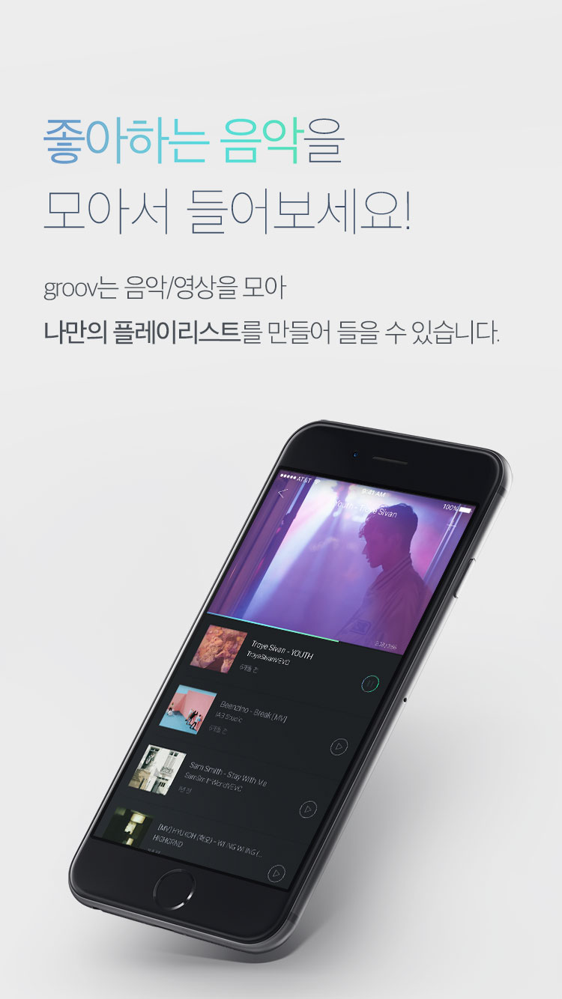
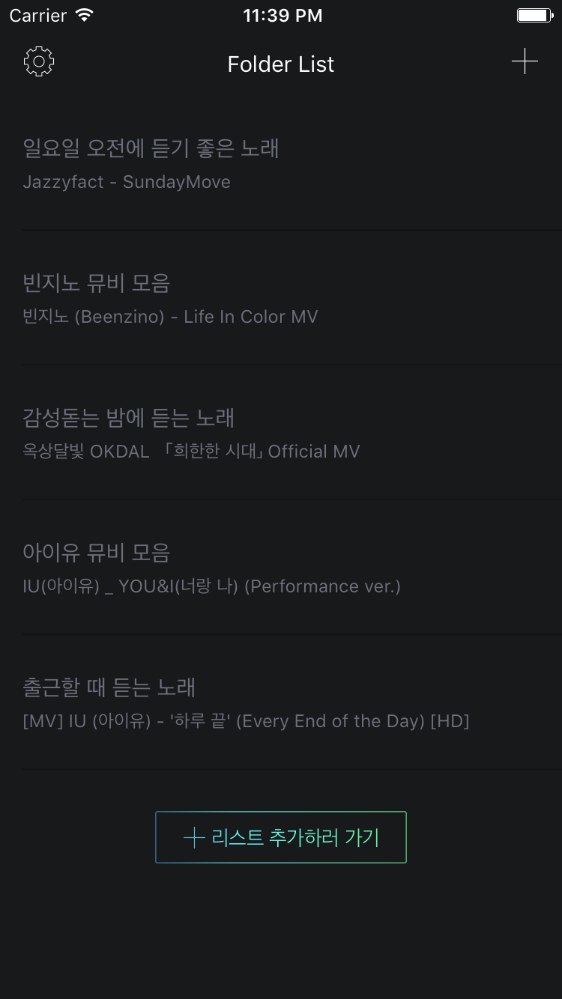
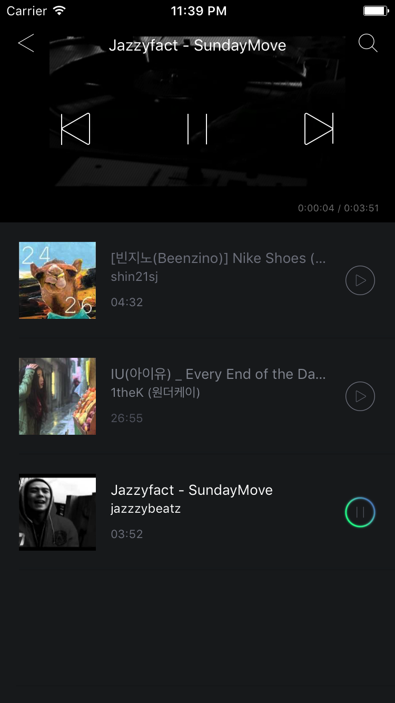
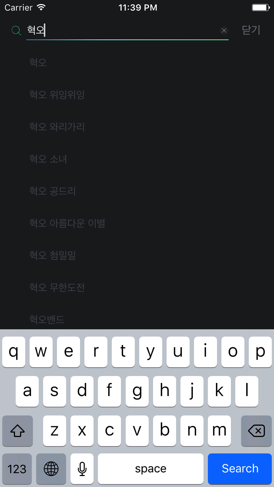
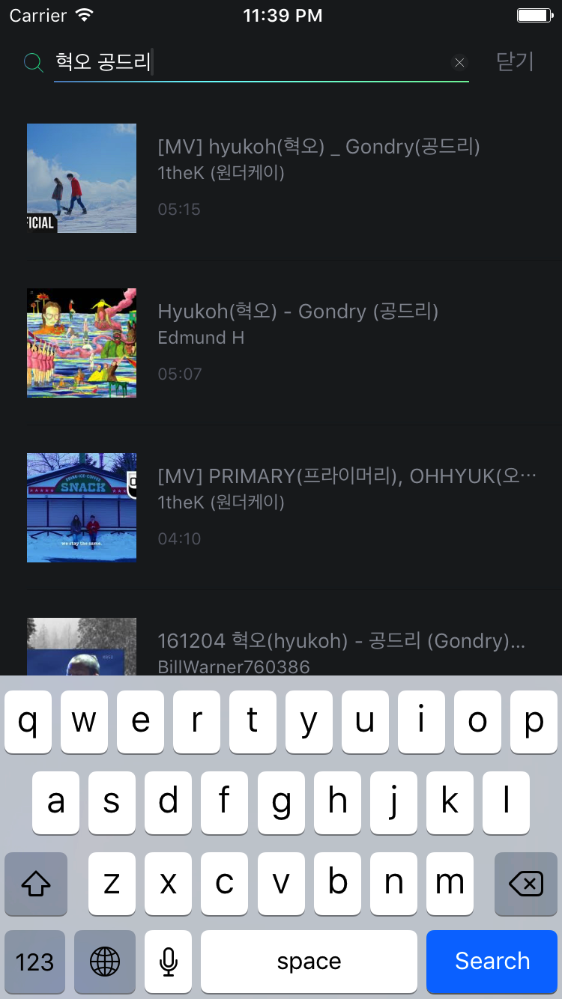

# GROOV.

    

좋아하는 음악을 모아서 들으세요!
GROOV.는 음악/영상을 모아 플레이리스트처럼 들을 수 있는 서비스입니다.

GROOV. 사용법
1. 폴더를 만든다.
2. 듣고 싶은 음악을 검색한 후 폴더에 추가한다.
3. 폴더에 모은 음악을 듣는다.

인스타그램에  #GROOV 를 태그해보세요!

Designed by @jinhwa.lee
Developed by @pilgwon.kim

CONTACT: facebook.com/AppGROOV

[1.1.0]
새로운 디자인을 입은 GROOV.를 만나보세요.

